# User Flows & Diagrams

**Status:** draft for review (2026-04-22)
**Companion docs:** [lessons-from-todays-install.md](./lessons-from-todays-install.md), [spark-installer-design-v1.md](./spark-installer-design-v1.md)

This document visualizes the journeys a Spark user takes — install, setup,
compose, extend, recover — and marks the friction points the design should
optimize. Diagrams are in Mermaid so they render natively on GitHub and stay
diffable in version control.

If you read only one section, read **§9 Friction map** at the bottom.

---

## 1. The three personas

Every flow in this doc serves at least one of three personas. A design choice
that helps one persona and hurts another is a choice; one that hurts all
three is a bug.

| Persona | Wants | Doesn't care about |
|---|---|---|
| **Casual user** | Chat with my AI on Telegram. Press buttons in a dashboard. Don't see a terminal. | Module internals, dep graphs, manifests, runtimes |
| **Power user / dev** | Compose Spark modules into custom workflows. Tweak configs. Inspect logs. | Hand-crafted infra setup, missing tools |
| **Module builder** | Ship a chip / skill / tool that anyone can install with one command. Get it discovered. | Running my own package registry |

---

## 2. Casual user journey (today vs proposed)

A `journey` diagram scores friction 1 (terrible) → 5 (great) at each step.
The proposed flow's lowest score is 4. Today's flow has multiple 1s and 2s.

### Today

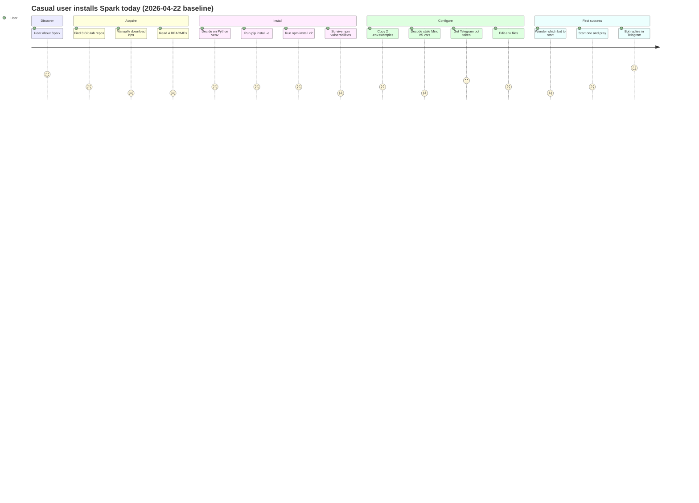

### Proposed

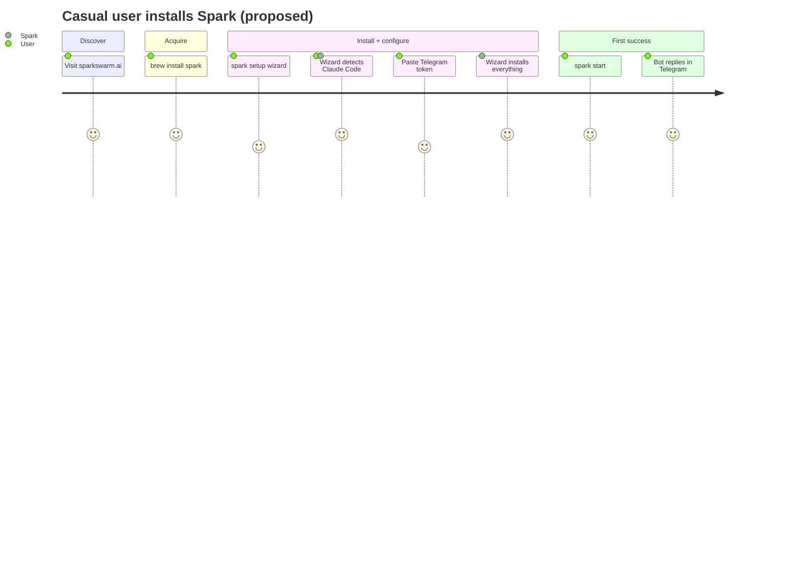

**Insight.** Today, the user makes ~12 decisions before getting their first
success. Proposed, they make 2 (`brew install spark`, paste a token). Every
removed decision is a removed drop-off point.

---

## 3. Module builder journey

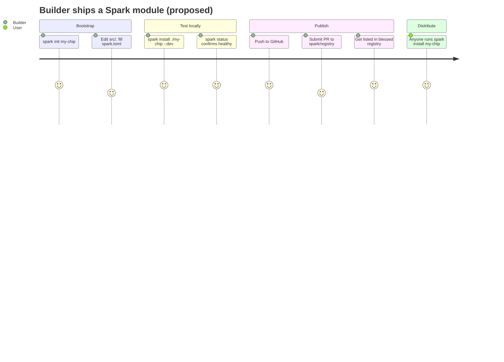

**Insight.** The builder never sets up CI, never publishes to a package
registry, never asks permission. Friction is a single PR to a public
`registry.json`.

---

## 4. Install lifecycle (sequence diagram)

What actually happens during `spark install <module>`. Each numbered step
maps to a phase in `spark-installer-design-v1.md` §`spark install lifecycle`.

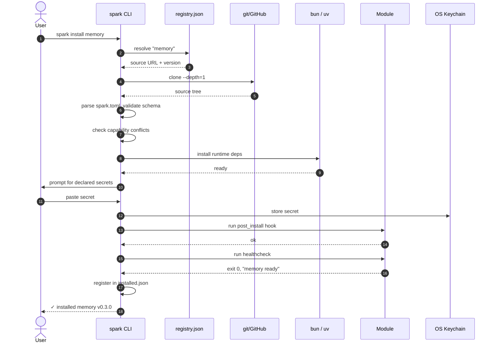

**Insight.** Steps 11–12 (secret prompt) are the only synchronous user
interaction. Everything else is automated. If a module has zero declared
secrets, the user sees install run start-to-finish without touching anything.

---

## 5. Setup wizard decision tree

The wizard runs once on first install. Its job: collect minimum info to make
Spark useful, then defer everything else.

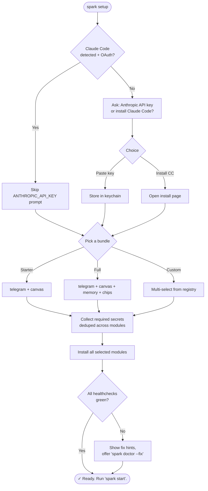

**Insight.** Two real branch points: "do you have Claude Code?" and "what
bundle?" Everything else is mechanical. Resist adding more questions later —
each one is a drop-off.

---

## 6. Module composition: capability resolution

When `spark install foo` runs and `foo` declares `needs.capabilities =
["memory.store"]`, the installer resolves which module satisfies it.

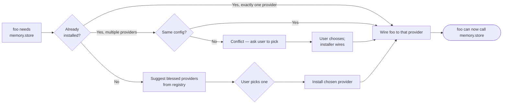

**Insight.** The "no provider installed" path is the most likely one in
practice. Make sure the suggestion list is opinionated — show 1-3 blessed
providers, not the full registry. Choice paralysis kills momentum.

---

## 7. Conflict resolution: two modules, same capability + same secret

The exact case from today: `spark-intelligence-builder` and
`spark-telegram-bot` both want to be the Telegram gateway. If both try to
poll the same bot token, Telegram returns `409 Conflict`.

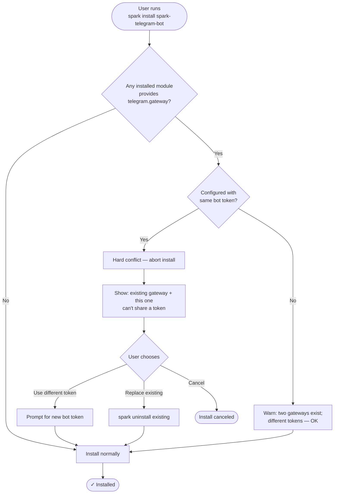

**Insight.** The installer should never put the user in a state where their
Telegram bot returns 409 errors. Detect at install time, not at runtime.

---

## 8. Secrets lifecycle

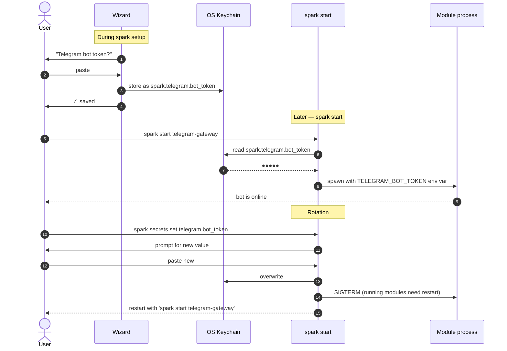

**Insight.** The user pastes a secret exactly once per secret. The module
process never touches the keychain — it reads an env var. This keeps modules
simple (no keychain SDK in every module) and rotation easy (one place to
change).

---

## 9. Architecture: CLI / dashboard / web installer

The three install/control surfaces share one backend: the CLI. No daemon, no
duplicated logic.

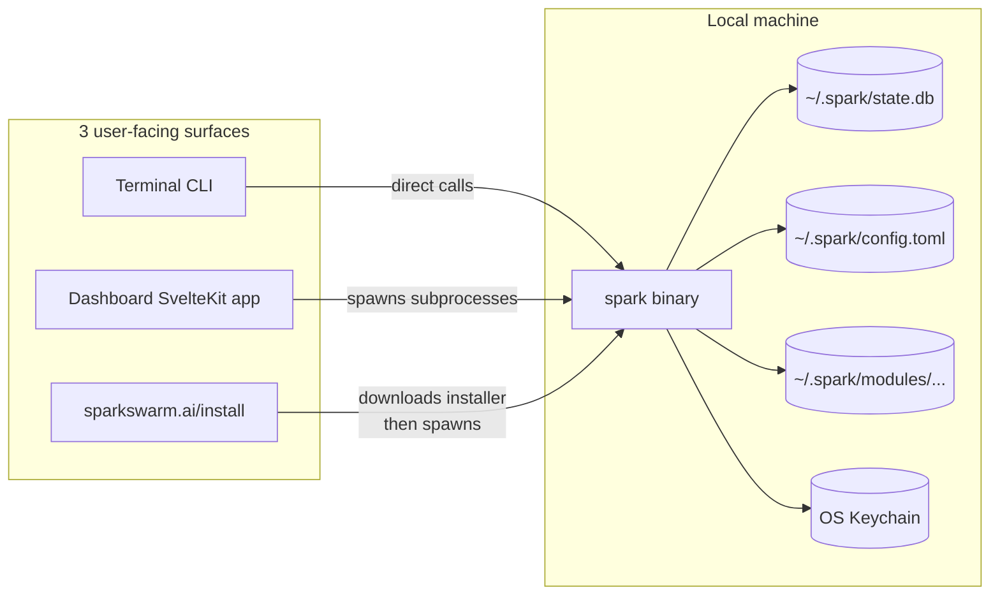

**Insight.** The dashboard isn't a separate app — it's a thin frontend that
shells out to `spark <command> --json` and renders the results. Same for the
web installer. Means: zero parallel implementations to keep in sync.

---

## 10. State layout: `~/.spark/` tree

What actually lives on disk after setup. Knowing this layout lets you
support, debug, and uninstall cleanly.

```
~/.spark/
├── config.toml             # user-level config (default model, dashboard port, telemetry opt-in)
├── state.db                # SQLite — per-module status, last healthcheck, etc.
├── secrets.enc             # only if no OS keychain available; encrypted with master pass
├── modules/
│   ├── spark-intelligence/
│   │   ├── spark.toml      # the module's manifest (copy from upstream)
│   │   ├── source/         # cloned source tree
│   │   └── .venv/          # uv-managed Python env (Python modules only)
│   ├── spawner-ui/
│   │   ├── spark.toml
│   │   ├── source/
│   │   └── node_modules/   # bun-managed (Node modules only)
│   └── memory/
│       └── ...
├── state/                  # per-module persistent state (SQLite, attachments, etc.)
│   ├── spark-intelligence/
│   ├── spawner-ui/
│   └── memory/
├── logs/                   # per-module logs, rotated
│   ├── spark-intelligence.log
│   ├── spawner-ui.log
│   └── memory.log
└── installed.json          # registry of installed modules + versions + install dates
```

**Insight.** A clean `spark uninstall <module>` removes only
`modules/<m>/`, `state/<m>/`, `logs/<m>.log`, and the `installed.json`
entry — never touches other modules. A clean `spark uninstall --all` removes
the entire `~/.spark/` tree (after confirming).

---

## 11. Today vs proposed: the two-Telegram-gateways case

Concrete example showing how the design closes today's worst confusion.

### Today

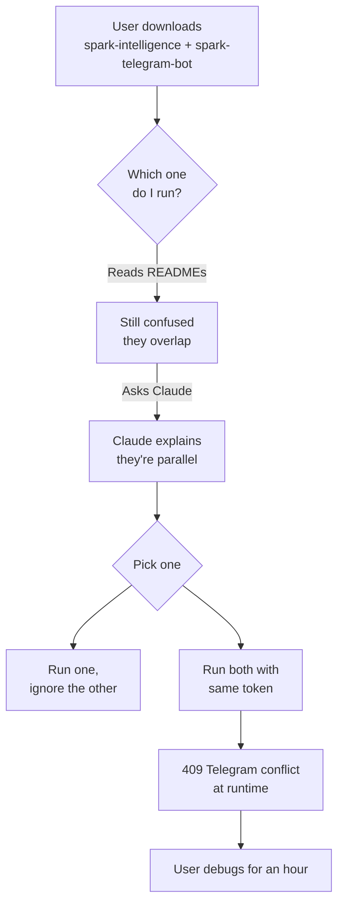

### Proposed

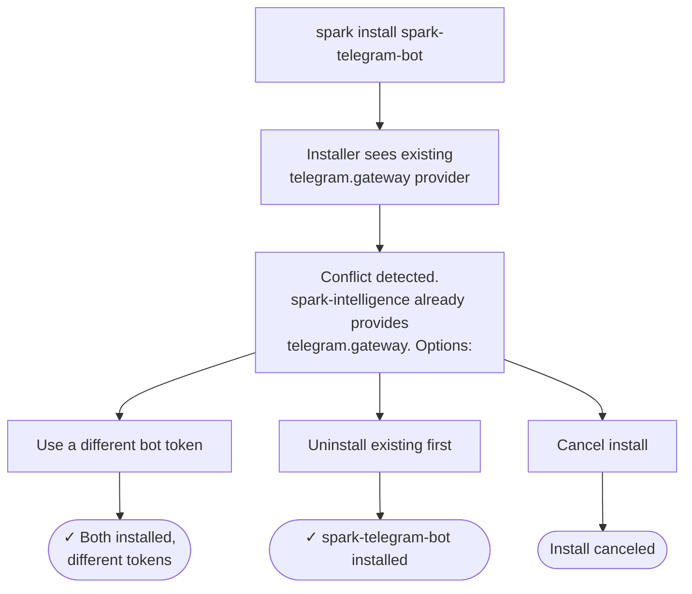

**Insight.** The conflict is detected and resolved before any code runs.
The user never reaches a 409 error.

---

## 12. Friction map (read this if nothing else)

The single most useful artifact in this doc. Each row is a place where
users drop off today; the right column is what removes the friction.

| Today's friction | Where in flow | Removed by |
|---|---|---|
| Manually find + zip-download 3 repos | Acquire | `brew install spark` + registry |
| Decide Python venv vs system | Install | `uv` handled by installer |
| Run `pip install -e .` | Install | `spark install` runs it under the hood |
| Survive `npm audit` warnings | Install | `bun install --frozen-lockfile`; module CI fixes vulns |
| Edit two `.env.example` files | Configure | One wizard, secrets to keychain |
| Decode stale Mind V5 env vars | Configure | Modules can't ship dead vars (manifest schema enforced) |
| Pick which Telegram bot to start | First success | One module owns `telegram.gateway`; conflicts caught at install |
| Discover modules via README hunting | Discover | Blessed registry + `spark search` |
| Know what depends on what | Compose | `spark status --graph` renders dep graph |
| Recover from a broken install | Recover | `spark doctor` with fix hints; resumable installs |
| Rotate secrets after uninstall | Uninstall | `spark uninstall` rotation hints + `pre_uninstall` hook |

---

## 13. What this doc does NOT cover (yet)

- **Multi-machine sync.** A user with Spark on laptop and desktop. Deferred
  to v1.1+.
- **Team / shared installs.** Spark for an org with shared modules and
  secrets. Deferred — needs a separate design.
- **Mobile.** Phone-first onboarding flow. Deferred — dashboard-via-web is
  v1's mobile story.
- **Recovery from corrupted state.db.** What happens if the SQLite is
  damaged. Worth a small section in the design doc; not visualized here.
- **Uninstall of Spark itself.** `brew uninstall spark` should leave
  `~/.spark/` intact (data preservation) by default, with `--purge` to
  remove everything. Worth a small section.

Add these as needed once the v1 spec is locked.
